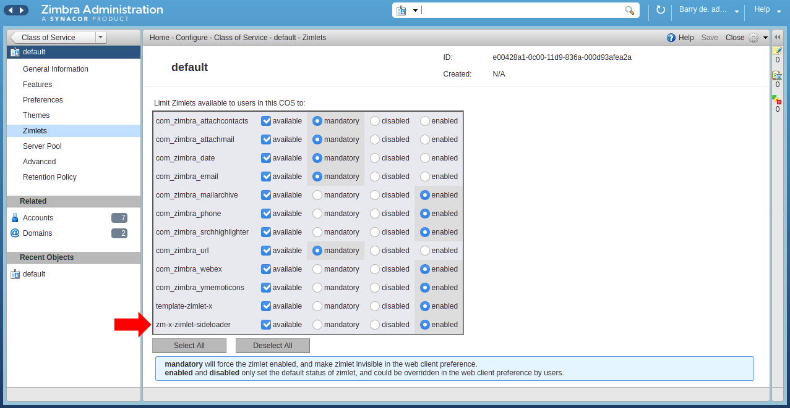
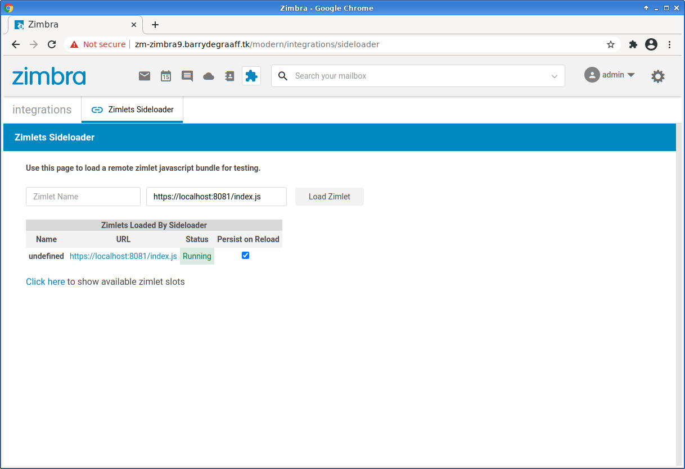
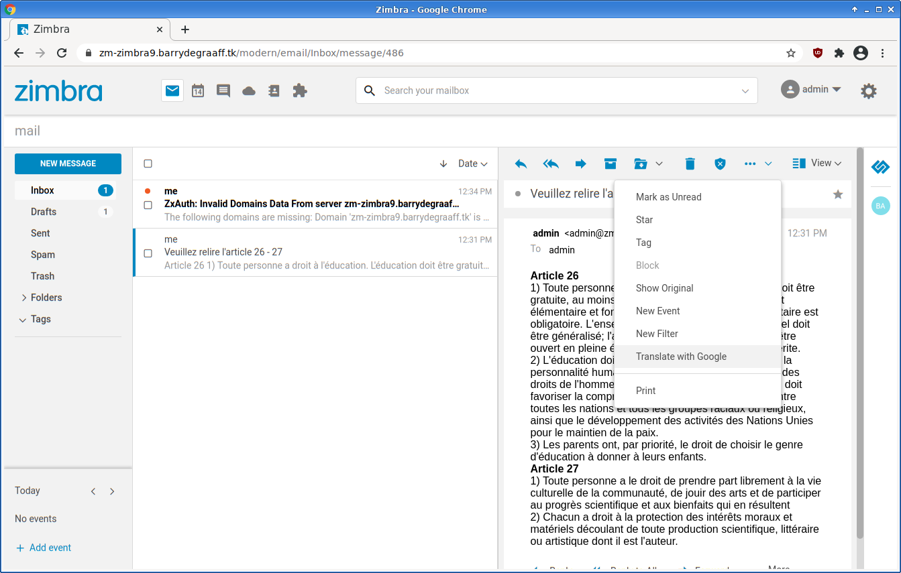
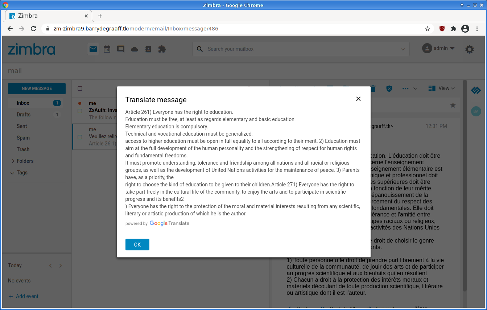

# Google Translate Zimlet

Google Translate Zimlet lets you translate incoming email messages to your own language using Google Translate. In case you receive messages in languages you cannot read yourself. **This Zimlet uses an undocumented Google Translate API - it may stop working unexpectedly** If you are new to Zimlets please take a look at the previous article at https://github.com/Zimbra/zm-zimlet-guide. An overview of all Zimlet guides can be found at https://wiki.zimbra.com/wiki/DevelopersGuide.

## Prerequisites 

To follow the steps in this article you need a Zimbra test server. You will need to have Zimbra 9 Network Edition. You can set this up in a Virtual Machine in the cloud or you can install it on your local computer inside VirtualBox/KVM/Parallels etc. If you decide to set it up on your local computer you need at least an i5 with 16GB of RAM and a SSD. Your test server needs to be accessible over SSH. Instructions on how to set up your Zimbra server: https://blog.zimbra.com/2018/01/install-zimbra-collaboration-8-8-ubuntu-16-04-lts/ make sure to install the latest patches. You can find instructions on how to install patches at https://wiki.zimbra.com/wiki/Zimbra_Releases

## Deploy the Zimlet Sideloader

You need to deploy and enable the Zimlet Sideloader on your development server. You only have to do this step once. 

      yum install zimbra-zimlet-sideloader
      apt install zimbra-zimlet-sideloader
      su - zimbra
      zmmailboxdctl restart


*Verify that the Sideloader Zimlet is available and enabled for your Zimbra Class of Service (CoS) by logging into the Admin UI -> Home -> Configure -> Class of Service.*


*Verify that the Sideloader Zimlet is available and enabled for your Zimbra and account by logging into the Admin UI -> Home -> Manage -> Accounts.*

## Installing Zimlet CLI

You can develop Zimbra Zimlets on any OS supported by NodeJS (https://nodejs.org/en/download/). This article will include Linux commands you can run on CentOS/Fedora/Redhat and Ubuntu. If you run on a different OS reading these commands should help you understand what you must do to get started. 

Zimbra provides a tool called Zimlet CLI that is based on Webpack. It is used for building/packaging your Zimlet and for working with Zimlet templates. Install it on your local computer:

As root:

      yum install nodejs
      apt install nodejs
      npm install -g @zimbra/zimlet-cli


## Downloading and running Google Translate Zimlet

Create a folder on your local computer to store the Google Translate Zimlet:

      mkdir ~/newsletter_zimlet
      cd ~/newsletter_zimlet
      git clone https://github.com/Zimbra/zimbra-zimlet-google-translate
      cd zimbra-zimlet-google-translate
      npm install
      zimlet watch

The output of this command should be:

```
Compiled successfully!

You can view the application in browser.

Local:            https://localhost:8081/index.js
On Your Network:  https://192.168.1.100:8081/index.js
```

Visit https://localhost:8081/index.js in your browser and accept the self-signed certificate. The index.js is a packed version of the `Google Translate Zimlet`. More information about the zimlet command, npm and using SSL certificates can be found in https://github.com/Zimbra/zm-zimlet-guide. 

## Sideload the Google Translate Zimlet

Log on to your Zimbra development server and make sure that you are seeing the modern UI. Then click the jigsaw puzzle icon and Zimlets Sideloader.

> 
*Sideload the Google Translate Zimlet by clicking Load Zimlet. The Zimlet is now added to the Zimbra UI in real-time. No reload is necessary.*

> 
*Find an email in a foreign language and click `Translate with Google` from the ...-menu.*

> 
*Mail is translated to English.*

## Visual Studio Code

Open the folder `~/newsletter_zimlet/zimbra-zimlet-google-translate` in Visual Studio code to take a look at the code in the Google Translate Zimlet. More information on this can be found at: https://github.com/Zimbra/zm-zimlet-guide.

## How to implement the menu item

First step is to implement the Zimlet slot `action-menu-mail-more` to add a menu item. This is done in 

* ~/newsletter_zimlet/zimbra-zimlet-google-translate/src/index.js

```javascript
//Load components from Zimbra
import { createElement } from "preact";

//Load the createMore function from our Zimlet component
import createMore from "./components/more";

//Create function by Zimbra convention
export default function Zimlet(context) {
	//Get the 'plugins' object from context and define it in the current scope
	const { plugins } = context;
	const exports = {};

	//moreMenu stores a Zimlet menu item. We pass context to it here
	const moreMenu = createMore(context);

	exports.init = function init() {
		// The zimlet slots to load into, and what is being loaded into that slot
		// (CustomMenuItem and Router are both defined below)
		plugins.register("slot::action-menu-mail-more", moreMenu);
	};

	return exports;
}
```

The usual wrapper component is used to pass on the context to a class component:

* ~/newsletter_zimlet/zimbra-zimlet-google-translate/src/components/more/index.js

```javascript
import { createElement } from 'preact';
import MoreMenu from '../more-menu';

export default function createMore(context) {
	return props => (
		<MoreMenu {...props}>{{context}}</MoreMenu>
	);
}
```

These steps are explained in more detail in https://github.com/Zimbra/zm-zimlet-guide. Now take a look at:

* ~/newsletter_zimlet/zimbra-zimlet-google-translate/src/components/more-menu/index.js

The inline comments explain how to Zimlet works.

```javascript
import { createElement, Component } from 'preact';
import { withIntl } from '../../enhancers';
import style from './style';
import { ModalDialog, ActionMenuItem, NakedButton } from '@zimbra-client/components';
import { withText } from 'preact-i18n';

// Please take a look at https://cloud.google.com/translate/attribution before using this Zimlet.

//Initialize and get translations from json files in intl folder
@withIntl()
@withText({
    title: 'gtranslate-zimlet.title',
    okBtn: 'gtranslate-zimlet.okBtn',
    error: 'gtranslate-zimlet.error'
})

//create class component
export default class MoreMenu extends Component {
    constructor(props) {
        super(props);
        //store the Zimlet context to the class
        this.zimletContext = props.children.context;
    }

    //This shows a toaster message/notification to the user, used in case there are errors calling Google Translates
    alert = (message) => {
        const { dispatch } = this.zimletContext.store;
        dispatch(this.zimletContext.zimletRedux.actions.notifications.notify({
            message: message
        }));
    }

    //remove html code from the email, translate only the text body
    strip = (html) => {
        let doc = new DOMParser().parseFromString(html, 'text/html');
        return doc.body.textContent || "";
    }

    //called when the user clicks the menu item
    handleClick = () => {
        /* In case the email was in text/plain format we can use this.props.emailData.text as the source for the translation, 
        otherwise we strip the html using the strip method (from above) and use that */
        let text = "";
        if (this.props.emailData.text) {
            text = this.props.emailData.text;
        }
        else {
            text = this.strip(this.props.emailData.html);
        }

        //Since it uses a GET request we need to make sure it is not too long.
        if (encodeURI(text).length > 4800) {
            text = text.substring(0, 4000) + '...';
        }

        //Do the request
        let url = "https://translate.googleapis.com/translate_a/single?client=gtx&sl="
            + "auto" + "&tl=" + this.props.locale + "&dt=t&q=" + encodeURI(text);

        var request = new XMLHttpRequest();
        let translateResult = "";
        request.open('GET', url);
        request.responseType = 'json'
        request.onreadystatechange = function (e) {
            if (request.readyState == 4) {
                if (request.status == 200) {
                    for (var i = 0; i < request.response[0].length; i++) {
                        translateResult += this.strip(request.response[0][i][0]) + "\r\n";
                    }
                    //Show result to the user
                    this.showDialog(translateResult);
                }
                else {
                    this.alert(this.props.error);
                }
            }
        }.bind(this);
        request.send();
    }

    //shows a modal dialog to the user with the translate result
    showDialog = (translateResult) => {
        const { title } = this.props;
        this.modal = (
            <ModalDialog
                class={style.modalDialog}
                contentClass={style.modalContent}
                innerClass={style.inner}
                onClose={this.handleClose}
                cancelButton={false}
                header={false}
                footer={false}
            >
                <div class="zimbra-client_modal-dialog_inner"><header class="zimbra-client_modal-dialog_header"><h2>{title}</h2><button onClick={this.handleClose} aria-label="Close" class="zimbra-client_close-button_close zimbra-client_modal-dialog_actionButton"><span role="img" class="zimbra-icon zimbra-icon-close blocks_icon_md"></span></button></header>
                    <div class="zimbra-client_modal-dialog_content zimbra-client_language-modal_languageModalContent">
                        <div id="translateResult" style="white-space: pre-wrap;">{translateResult}</div>
                        <div class={style.attribution}></div>
                    </div>
                    <footer class="zimbra-client_modal-dialog_footer" id="nextcloudDialogButtons">
                        <button onClick={this.handleClose} class="blocks_button_button blocks_button_primary blocks_button_regular zimbra-client_sidebar-primary-button_button">{this.props.okBtn}</button>
                    </footer>
                </div>
            </ModalDialog>
        );

        const { dispatch } = this.zimletContext.store;
        dispatch(this.zimletContext.zimletRedux.actions.zimlets.addModal({ id: 'addEventModal', modal: this.modal }));

    }

    //implements closing of the dialog, when the user clicks OK button.
    handleClose = e => {
        const { dispatch } = this.zimletContext.store;
        dispatch(this.zimletContext.zimletRedux.actions.zimlets.addModal({ id: 'addEventModal' }));
    }

    //Returns the `Translate with Google` menu item.
    render() {
        return (
            <div>
                <ActionMenuItem onClick={this.handleClick}>
                    Translate with Google
                </ActionMenuItem>
            </div>
        );
    }

}
```
